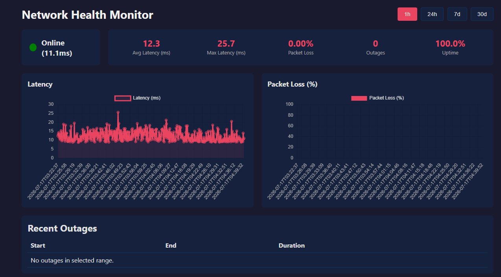

# Network Health Monitor

A **Raspberry Pi-based platform** that continuously monitors internet connectivity—latency, packet loss, and outages—and presents live data on a web dashboard. Built as a self-directed engineering project to learn systems programming, networking, databases, and full-stack development.



## Features

- **Real-time latency monitoring** — pings a configurable target every 10 seconds.
- **Automatic outage detection** — triggers after 3 consecutive failures, logs start/end times.
- **Packet loss tracking** — aggregated over time windows.
- **Web dashboard** with:
  - Live status indicator (green/yellow/red)
  - Interactive latency and packet loss charts (Chart.js)
  - Summary statistics (avg/max latency, uptime, total outages)
  - Time range selector: 1h, 24h, 7d, 30d
- **All data stored locally** in SQLite, no cloud dependency.
- **Runs 24/7** as a systemd service on a headless Raspberry Pi.

## Architecture

```mermaid
graph LR
    A[C++ Collector<br/>runs every 10s] -->|INSERT| B[(SQLite Database)]
    B -->|SELECT| C[Python Flask API]
    C -->|JSON| D[Web Dashboard<br/>HTML/JS/Chart.js]
    D -->|Browser| E[User]
    A -->|systemd service| F[Raspberry Pi 4<br/>Raspberry Pi OS Lite]
    C --> F
