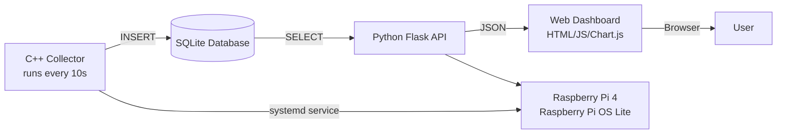

# Network Health Monitor

A **Raspberry Pi-based platform** that continuously monitors internet latency, packet loss, and outages; presents live data on a web dashboard. Built as an individual engineering project to learn systems programming, networking, databases, and full-stack development.

## Features

- **Real-time latency monitoring** - pings a configurable target every 10 seconds.
- **Automatic outage detection** - triggers after 3 consecutive failures, logs start/end times.
- **Packet loss tracking** is aggregated over time windows.
- **Web dashboard** with:
  - Live status indicator (green/yellow/red)
  - Interactive latency and packet loss charts (Chart.js)
  - Summary statistics (avg/max latency, uptime, total outages)
  - Time range selection: 1h, 24h, 7d, 30d
- **All data stored locally** in SQLite, no cloud dependency.
- **Runs 24/7** as a systemd service on a headless Raspberry Pi.

## Architecture

## Technology Stack

- **Data collection**: C++17, SQLite3, POSIX (popen)
- **Backend**: Python 3, Flask, SQLite3
- **Frontend**: Vanilla Javascript, Chart.js, CSS grid
- **Infrastructure**: Linux (Raspberry Pi OS Lite), systemd, Git, SSH
- **Hardware**: Raspberry Pi 4 Model B Headless  
